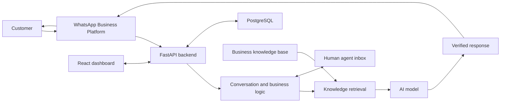
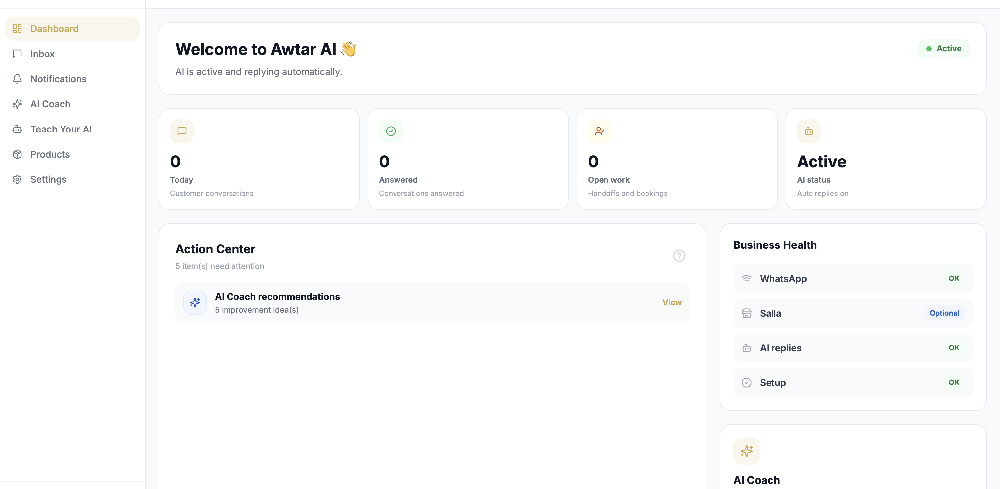
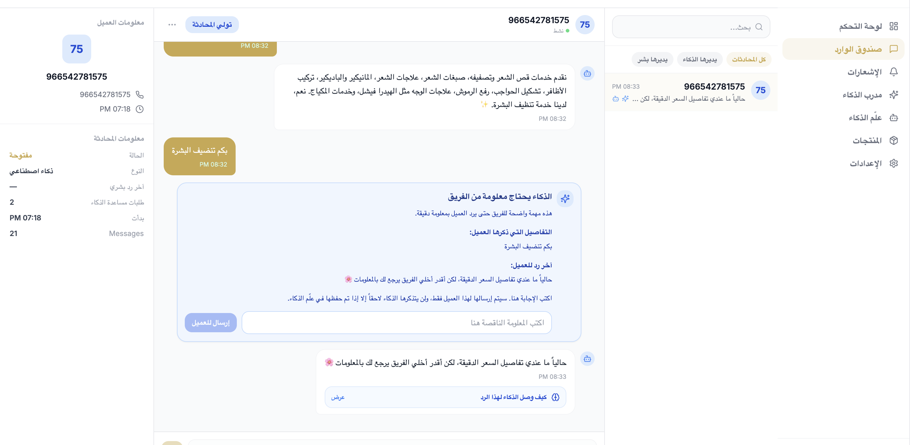

# Awtar AI

Awtar AI is an AI-powered WhatsApp customer support SaaS platform for small and medium-sized businesses. It helps businesses automate customer communication, answer questions using verified business information, manage conversations, and hand chats over to human staff when needed.

## Important Notice

This repository is a public project showcase only.

This repository contains documentation and selected product visuals only. The production source code, system prompts, internal architecture, security controls, and proprietary business logic are maintained in a private repository.

Nothing in this repository should be interpreted as production configuration, a complete technical specification, or an open-source release of the Awtar AI application.

## Product Overview

Small and medium-sized businesses often handle repetitive customer questions across busy messaging channels while also needing accurate, business-specific answers and a reliable path to human support. Awtar AI brings those workflows into one platform for businesses such as salons, boutiques, clinics, service providers, and online merchants.

The platform is designed to help teams organize business knowledge, automate appropriate conversations, manage customer chats, and allow staff to step in when human attention is needed.

## Core Features

- AI-powered WhatsApp customer support
- Multi-tenant business architecture
- Secure business onboarding
- Meta WhatsApp Business Platform integration
- Semantic search and structured knowledge retrieval
- Business-specific knowledge bases
- Products, services, offers, policies, and FAQ support
- Human handoff and conversation management
- Role-based access control
- Analytics and operational insights
- Optional e-commerce integrations
- Arabic and English customer communication

## Technology Overview

- Python
- FastAPI
- PostgreSQL
- SQLAlchemy
- React
- Vite
- Docker
- Railway
- Vercel
- Meta WhatsApp Business Platform
- Gemini API

## High-Level Architecture

This diagram is intentionally simplified. See [docs/architecture.md](docs/architecture.md) for a high-level component overview.

## Security and Privacy

Awtar AI is designed around tenant-isolated business data, role-based access control, input validation, and customer-data protection. The platform also considers secure secret management through environment variables, prompt injection defenses, verified knowledge retrieval, controlled human handoff, webhook security, and rate limiting.

Security implementation details are intentionally excluded from this public repository. See [docs/security.md](docs/security.md) for the project’s high-level security principles.

## Screenshots

### Operations Dashboard

The dashboard gives business teams a quick view of conversation activity, open work, integration health, and AI coaching recommendations.

### Human-in-the-Loop Support

When verified information is unavailable, Awtar AI can pause automation and request a precise answer from the team instead of guessing. The interface preserves the customer context and clearly shows what information is needed.

## My Role

I founded and developed Awtar AI. My work includes:

- Designing the backend architecture
- Building authentication and role-based access control
- Integrating the Meta WhatsApp Business Platform
- Developing AI retrieval and response workflows
- Implementing multi-tenant business isolation
- Deploying and maintaining the platform
- Working on security, reliability, and product design

## Project Status

Awtar AI is actively under development. The production application and source code are private.

## Contact

- **Name:** Leen Dalloul
- **LinkedIn:** [linkedin.com/in/leen-dalloul-1514872a3](https://www.linkedin.com/in/leen-dalloul-1514872a3)
- **Email:** [leendalloul66@gmail.com](mailto:leendalloul66@gmail.com)

## License

The contents of this showcase repository are provided for portfolio and evaluation purposes. All rights are reserved. See [LICENSE](LICENSE).
