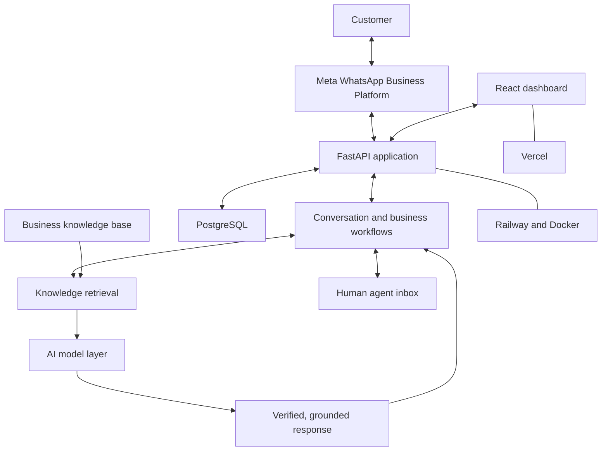

# High-Level Architecture

## Platform Overview

Awtar AI is a multi-tenant SaaS platform that connects business knowledge and customer-support workflows to WhatsApp. It supports automated, grounded responses and gives authorized team members a dashboard for managing knowledge, conversations, and human handoffs.

This document intentionally describes the platform at a conceptual level. It does not disclose production routes, schemas, internal service names, prompts, security implementation, configuration, or proprietary logic.

## Simplified Data Flow

1. A customer sends a message through WhatsApp.
2. The Meta WhatsApp Business Platform delivers the message to the Awtar AI backend.
3. The backend associates the conversation with the appropriate business context.
4. The conversation workflow requests relevant, business-approved knowledge.
5. The AI layer uses that verified context to prepare an appropriate response.
6. The response is returned to the customer through WhatsApp.
7. When needed, the conversation is handed to an authorized human agent.
8. The dashboard presents permitted conversation, knowledge, and operational information to business users.

## Architecture Diagram

## Component Overview

### Frontend

The React and Vite dashboard provides authorized business users with interfaces for onboarding, knowledge management, conversation management, human handoff, and operational insights. The public showcase does not document private screens, client-side security details, or internal requests.

### Backend

The Python and FastAPI backend coordinates authenticated business workflows, messaging events, knowledge access, AI-assisted responses, and dashboard operations. Its production interfaces and proprietary business logic remain private.

### Database

PostgreSQL, accessed through SQLAlchemy, stores application data required by the platform. Business data is handled in a multi-tenant context. Database schemas, models, queries, identifiers, and connection details are not included here.

### Messaging Integration

The platform integrates with the Meta WhatsApp Business Platform to receive and send business messaging events. Verification, credentials, webhook handling details, and production configuration are confidential.

### AI Layer

The AI layer uses the Gemini API together with approved business knowledge to support relevant customer responses. System prompts, retrieval scoring, safeguards, thresholds, and other response-generation details are proprietary and are not documented publicly.

### Deployment Platforms

The application uses Docker for consistent packaging, Railway for backend deployment, and Vercel for the web dashboard. Environment configuration, infrastructure topology, credentials, and operational controls remain private.

## Publication Boundary

This architecture is intentionally simplified for professional presentation. It must not be expanded with API routes, database schemas, SQL models, internal class names, infrastructure secrets, system prompts, retrieval scoring logic, webhook verification implementation, or proprietary algorithms.
